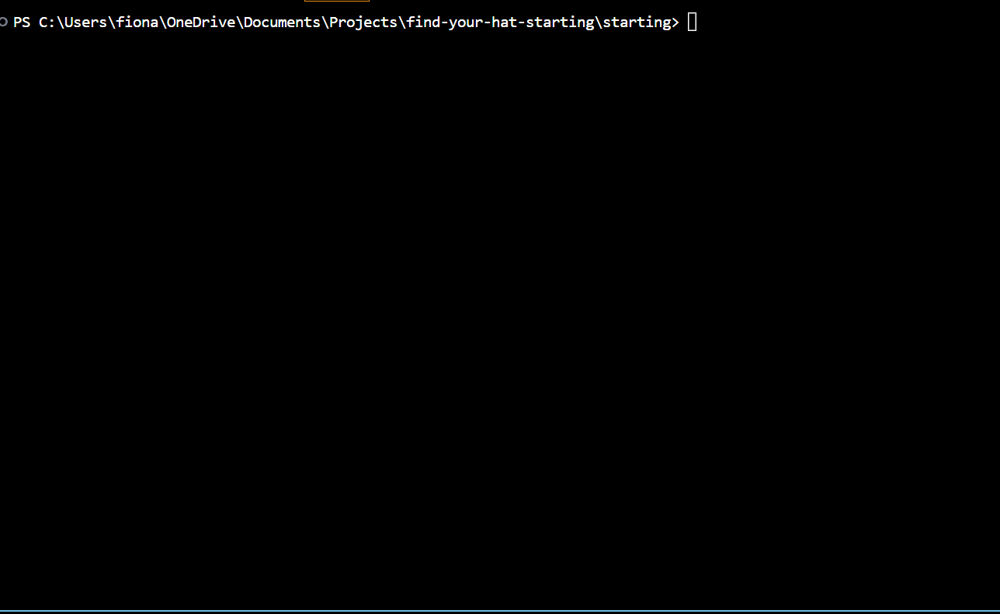

# find-your-hat
The object of the game is to get from your starting point __'*'__ to your hat **'^'** \
You can move Up(u), Down(d), Left(l) or Right(r).\
You lose if you fall in a hole **'0'** or go outside the maze. \
The maze provided by the game will always have a solution.

# Find Your Hat Game
## Demo

## Game Features
- Maze generator(height, width, percentageHoles)
- Maze solver function to check game maze can be solved by player.
- Random Starting and End Point positions
- Random Holes positions
- Use of terminal-kit to pretify terminal output /
(I'm not sure why the colours look off on the gif, they look fine on my terminal, maybe a screen recorder issue)
## Classes
The Maze class generates an array of arrays to represent the maze.\
The user can specify the mazeHeight and mazeWidth and the percentage of the Maze that will be filled with holes.\
The Maze will have one starting point and one ending point.   
## Functions
__solveMaze(maze)__ \
Checks the maze has a solution before maze is used for game.

__randomNumber(mazeHeight, mazeWidth)__ \
Generates a random point in the nested array. Used to select random starting point, end point and holes. 

__isAHole(maze, square)__ \
Returns if a square in the maze contains a hole

__checkValidPosition(num_y, num_x)__\
Checks if the player is still in the maze or has gone out of bounds. 

__moveLeft(), moveRight(), moveUp(), moveDown()__ \
Functions change the this.playerPosition within the Maze Class to move around the maze

__checkPlayerStatus()__\
Checks if the player has found their hat(won) or fallen in a hole(Lost) 

__print()__\
Uses terminal-kit to print the characters in the maze in color on the terminal 

